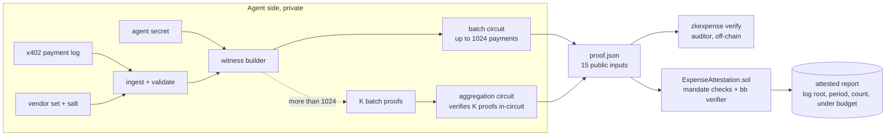

# zkExpense

**One zero-knowledge proof for a month of AI agent payments.** An agent that pays for APIs over [x402](https://github.com/coinbase/x402) proves to its principal or auditor that every payment went to an approved vendor, inside the period, and that the total stayed within budget, without revealing any vendor, amount or total.

> **Status: unaudited research code.** The circuits, the prover and the Solidity contracts have not been audited, the Solidity verifiers are generated by a nightly Barretenberg build, and the statement has a known gap (an agent can omit payments from its own log, see [Security model](#security-model-and-limitations)). Do not rely on it to protect real funds yet.

```
$ node dist/cli.js prove examples/log-347.json --vendors examples/vendors.json --budget 500
created agent secret at /home/you/zkexpense/.zkexpense/secret (keep it: it lets you disclose single payments later)
zkexpense: proving 347 payments, 2026-09-01T00:00:00Z .. 2026-09-30T23:59:59Z, budget $500.00
circuit batch_512: 347 payments, 165 padding slots
wrote proof.json
  circuit       batch_512
  payments      347
  under budget  true (total hidden)
  log root      0x0162dfa85e212cdd867dbf88cd2d0e9030c49215718daf20d3b4bd0e9d5c5293
  vendor root   0x17455097acf52e196ca108783a9cd491647e14008f70b80fb13bd3edf4cf245c
  proof         10176 bytes, proved in 7.43s

$ node dist/cli.js verify proof.json --vendor-root $(node dist/cli.js vendor-root examples/vendors.json)
zkexpense report for agent:research-bot-7 (batch_512)
  payer     0x8fdbd54a52d7a3132c96a731857857d7094fe218 on chain 8453, asset 0x833589fcd6edb6e08f4c7c32d4f71b54bda02913
  period    2026-09-01T00:00:00Z .. 2026-09-30T23:59:59Z
  payments  347
  budget    $500.00, total hidden
  log root  0x0162dfa85e212cdd867dbf88cd2d0e9030c49215718daf20d3b4bd0e9d5c5293
  vendors   0x17455097acf52e196ca108783a9cd491647e14008f70b80fb13bd3edf4cf245c
  [ok] proof valid (bb, UltraHonk)
  [ok] report matches public inputs
  [ok] total within budget
  [ok] vendor root is the approved set
  verified in 8.2 ms [bb.js (in-process)]
```

Real output of the quickstart (only the home directory in the first line is shortened), captured on an Apple M4 laptop on 2026-10-05 while it was busy with other jobs (load average about 9 on 10 cores), so the timings are single noisy runs. The sample log is synthetic. Measured numbers with methodology are in [BENCHMARKS.md](BENCHMARKS.md): 347 payments prove in 3.1 s (best of 3), the proof is 10,176 bytes, it verifies in 3.7 ms in-process or for 2.68M gas on-chain, and on-chain verification cost stays between 2.56M and 2.86M gas from 64 to 4,096 payments.

## Why

Agents that pay per call make hundreds of tiny payments a month. The principal who funds the agent wants to know the agent stayed inside its mandate: approved vendors only, within budget, inside the reporting period. Today that means handing over the full payment log, which exposes which APIs the agent uses, how much, and when: exactly what a company wants to keep from competitors and from whoever audits it. zkExpense replaces the log with one proof that checks the policy and reveals only the aggregate statement. It descends from Solva (zero-knowledge solvency proofs on Starknet): the same idea of proving an aggregate statement about private values, applied to agent spend.

## Quickstart

Prerequisites: Node 22+, [nargo](https://noir-lang.org/docs/getting_started/noir_installation) `1.0.0-beta.19`, [bb](https://github.com/AztecProtocol/aztec-packages/tree/master/barretenberg/bbup) `4.0.0-nightly.20260120` (install with `bbup -v 4.0.0-nightly.20260120`), and [Foundry](https://getfoundry.sh). The versions are pinned because the committed Solidity verifiers are generated from them.

```bash
git clone https://github.com/agnij-dutta/zkexpense && cd zkexpense
scripts/setup.sh        # npm install, TS build, forge deps, compile circuits, generate verifiers (~2 min)

# a month of synthetic x402 payments from one agent wallet (347 calls to 12 API vendors)
node dist/cli.js sample --count 347 --out examples

# one proof: all 347 payments, approved vendors only, September, total <= $500
node dist/cli.js prove examples/log-347.json --vendors examples/vendors.json --budget 500

# auditor side
node dist/cli.js verify proof.json --vendor-root $(node dist/cli.js vendor-root examples/vendors.json)

# all tests: TypeScript (incl. real prove/verify), Noir, Foundry
npm test
```

The first `prove` creates `.zkexpense/secret` (mode 0600), the agent's secret for salts and blinding. Keep it: it is needed to disclose single payments later.

## Usage

### CLI

`node dist/cli.js <command>` (or `zkexpense <command>` once the package is linked with `npm link`).

| command                                                    | what it does                                                             |
| ---------------------------------------------------------- | ------------------------------------------------------------------------ |
| `prove <log.json> --vendors <vendors.json> --budget <usd>` | prove the log under the policy, write `proof.json`                       |
| `verify <proof.json>`                                      | verify a proof and print the report it proves                            |
| `disclose <log.json> --proof <proof.json> --tx <hash>`     | open ONE payment by settlement tx (preimage + Merkle path), nothing else |
| `disclose <log.json> --proof <proof.json> --index <n>`     | open ONE payment by its position in the proven log                       |
| `check-disclosure <disclosure.json> --proof <proof.json>`  | auditor checks an opening against the proven log root                    |
| `vendor-root <vendors.json>`                               | the salted root a principal publishes for its approved set               |
| `inspect <log.json>`                                       | sanity summary of a log (count, payees, total, first/last)               |
| `sample --count <n>`                                       | write a deterministic synthetic log and vendor set                       |

| flag                                           | command                 | default                                     | meaning                                                                      |
| ---------------------------------------------- | ----------------------- | ------------------------------------------- | ---------------------------------------------------------------------------- |
| `--vendors <file>`                             | prove                   | required                                    | approved vendor set                                                          |
| `--budget <usd>`                               | prove                   | required                                    | budget in dollars of the asset (`500`, `12.5`)                               |
| `--period YYYY-MM`                             | prove                   | month of the first payment                  | reporting period                                                             |
| `--from YYYY-MM-DD --to YYYY-MM-DD`            | prove                   |                                             | explicit period, UTC, inclusive                                              |
| `--disclose-total`                             | prove                   | off                                         | reveal the exact total instead of only `total <= budget`                     |
| `--prev <proof.json>`                          | prove                   |                                             | previous period's proof; continues its hash chain                            |
| `--circuit <name>`                             | prove                   | smallest that fits                          | `batch_64`, `batch_256`, `batch_512`, `batch_1024`, `agg_64x2`, `agg_1024x4` |
| `--secret-file <path>`                         | prove, disclose         | `.zkexpense/secret`                         | agent secret (created on first use)                                          |
| `--out <file>`                                 | prove, disclose, sample | `proof.json`, `disclosure.json`, `examples` | output path (directory for `sample`)                                         |
| `--vendor-root 0x..`                           | verify                  |                                             | fail unless the proof uses this vendor root                                  |
| `--payer 0x..`                                 | verify                  |                                             | fail unless the proof is for this wallet                                     |
| `--max-budget <usd>`                           | verify                  |                                             | fail unless the proven budget is at most this                                |
| `--engine auto\|js\|cli`                       | verify                  | `auto`                                      | in-process `@aztec/bb.js` or the `bb` binary                                 |
| `--seed <n>`, `--month YYYY-MM`, `--rogue <n>` | sample                  | `42`, `2026-09`, `0`                        | PRNG seed, month, payments redirected to an unapproved vendor                |

Exit codes: `0` ok, `1` verification failed or error, `2` usage error, `3` proof written but the total is over budget, `4` the log violates the policy so no proof can exist.

There are no environment variables; `nargo` and `bb` are taken from `PATH`.

### Input format

A log is a list of x402 payments, either flat rows

```json
{
  "transaction": "0x<32-byte settlement tx hash>",
  "payer": "0x..",
  "payTo": "0x..",
  "amount": "12500",
  "asset": "0x833589fcd6edb6e08f4c7c32d4f71b54bda02913",
  "network": "base",
  "timestamp": 1788221000
}
```

or the raw pair an x402 client sees, `{ paymentRequirements, settleResponse, timestamp }` (see `examples/x402-raw.json`). `amount` is in atomic units (USDC has 6 decimals), `network` is an x402 name (`base`, `base-sepolia`, `avalanche-fuji`, ...) or CAIP-2 (`eip155:8453`), `timestamp` is the settlement block time. One report covers one payer wallet, one asset and one chain; duplicate settlement txs and failed settlements are rejected. Logs are wrapped as `{ "agentId": "...", "payments": [...] }` or given as a bare array.

The vendor set is `{ "salt": "0x..", "vendors": [{ "name": "...", "address": "0x.." }] }`, up to 256 vendors. The salt keeps the published vendor root from being brute-forced against known addresses.

### Library

`npm run build` emits `dist/` with type declarations; `import { ... } from "zkexpense"` (see `src/index.ts`).

| function                                                                       | purpose                                          |
| ------------------------------------------------------------------------------ | ------------------------------------------------ |
| `ingestLog(json)`, `ingestVendors(json)`                                       | validate and normalize inputs                    |
| `proveReport(log, vendors, opts)`                                              | prove; returns the `ProofJson` the CLI writes    |
| `verifyProofJson(proofJson, { engine, runs })`                                 | verify; returns `{ ok, consistent, report, ms }` |
| `disclose(log, proofJson, secret, txOrIndex)`, `checkDisclosure(d, proofJson)` | single-payment openings                          |
| `vendorRoot(vendors)`, `leafHash`, `chainStep`, `commitTotal`                  | the hashes the circuit uses                      |
| `pickCircuit(n)`, `generateSample(opts)`                                       | circuit selection, synthetic data                |

### Contract

`contracts/src/ExpenseAttestation.sol`:

| function                                                                                                  | who       | what                                           |
| --------------------------------------------------------------------------------------------------------- | --------- | ---------------------------------------------- |
| `registerAgent(agentId, payer, asset, chainId, vendorRoot, budgetCap, firstPeriodStart, minPeriodLength)` | principal | create a mandate under `msg.sender`            |
| `updateMandate(agentId, vendorRoot, budgetCap)`                                                           | principal | change vendor set and cap for future reports   |
| `submitReport(principal, agentId, circuitId, proof, publicInputs)`                                        | anyone    | verify and record the next report              |
| `addVerifier(circuitId, verifier)`                                                                        | owner     | register a bb-generated verifier (append-only) |
| `pause()` / `unpause()`                                                                                   | owner     | stop or resume submissions                     |
| `mandate`, `attestation`, `isAttested`                                                                    | anyone    | views                                          |

## How it works



### What is proven

Each payment becomes a leaf

```
leaf = Poseidon2(payer, payTo, amount, asset, chainId, timestamp, txHash_hi, txHash_lo, salt)
```

with a per-payment salt derived from the agent's secret. For the first `count` slots of a fixed-size batch (the rest is zero padding that no constraint reads), the circuit (`circuits/lib/src/lib.nr`) proves:

- the payee is non-zero and equals `vendors[vendor_idx]` of the private vendor table whose salted Poseidon2 Merkle root is `vendorRoot`
- `periodStart <= ts_0`, every `ts <= periodEnd`, and payments are in strictly increasing `(timestamp, tx hash)` order, so no settlement tx appears twice
- `logRoot` is the Poseidon2 Merkle root of all leaves, and `chainOut = H(..H(H(chainIn, leaf_0), leaf_1).., leaf_last)`
- `total = sum(amounts)` (u64 amounts into a u128 sum, overflow checked), `underBudget = total <= budget`, `totalCommit = H(total, blind)`, and `disclosedTotal = discloseTotal ? total : 0`

Public inputs (15 fields, in this order):

| #   | name        | #   | name          | #   | name                                |
| --- | ----------- | --- | ------------- | --- | ----------------------------------- |
| 0   | payer       | 5   | budget        | 10  | count                               |
| 1   | asset       | 6   | discloseTotal | 11  | underBudget                         |
| 2   | chainId     | 7   | chainIn       | 12  | disclosedTotal (0 unless disclosed) |
| 3   | periodStart | 8   | logRoot       | 13  | totalCommit                         |
| 4   | periodEnd   | 9   | vendorRoot    | 14  | chainOut                            |

Revealed: payer wallet, asset, chain, period, budget, number of payments, roots. Hidden: every payee, amount, timestamp and tx hash, the vendor list, and the total (unless disclosed).

### Proving approach: fixed batches plus recursive aggregation

A payment costs about 600 UltraHonk gates (3 Poseidon2 permutations for the leaf, 1 for the hash chain, 1 for the Merkle tree, a ROM lookup for vendor membership, ordering and range checks). Vendor membership is a lookup into the committed vendor table rather than a Merkle path per payment, which is about 8x cheaper. A 1024-payment batch is 660k gates, so a month of agent spend usually fits in one proof with no recursion.

Beyond 1024 payments, `agg_1024x4` verifies four batch proofs in-circuit with Noir's `std::verify_proof_with_type` (bb's `noir-recursive-no-zk` target) and outputs one report over 4096 payments. Batch roots combine so the aggregated `logRoot` equals the flat Merkle root over all slots, the hash chain is threaded batch to batch, each batch is proven over a sub-period so timestamp order holds across batches, and the inner verification key hash is pinned as a circuit constant. Inner proofs are non-ZK (they never leave the prover); the final proof is ZK with a Keccak transcript for EVM verification. Recursive verification defers the pairing check to the final verifier, so `bb prove` happily produces an aggregate over a bad inner proof that then never verifies; the CLI self-verifies every proof before writing it.

Folding (one step per payment) was the alternative. bb's folding is Aztec's client-IVC scheme, which expects Aztec kernel-shaped circuits and does not produce a proof the generated Solidity verifier accepts, so it is not used.

### On-chain attestation

A principal registers a mandate: payer wallet, asset, chain, vendor root, per-report budget cap, the start of the first period, and a minimum period length. `submitReport` is permissionless. It checks that the public inputs are canonical field elements and match the mandate, that the period is over, starts exactly where the previous one ended (the first one at `firstPeriodStart`), is at least `minPeriodLength` long, and that `chainIn` equals the previous report's `chainOut`. Then it calls the bb-generated verifier and stores `{logRoot, publicInputsHash, period, count, underBudget}`. Over-budget reports are recorded and emit `BudgetExceeded`. Mandates are keyed by `(principal, agentId)`, so nobody can squat or front-run an agent id.

The generated verifiers sit just over EIP-170 at 200 optimizer runs, so `foundry.toml` compiles them with `optimizer_runs = 1`.

## Security model and limitations

Full details, review findings and how to report issues: [SECURITY.md](SECURITY.md).

1. **The agent writes its own log, so it can leave payments out.** The proof covers the payments in the log; it cannot see payments the agent omitted, and it cannot tell a real settlement tx hash from a made-up one. Mitigations, from cheapest to strongest:
   - _Two-way spot checks (implemented)._ The auditor samples real on-chain transfers out of the payer wallet and asks for `disclose --tx`: an omitted payment cannot be opened. The auditor also samples log positions and asks for `disclose --index`: a fabricated entry opens to a tx hash that does not exist on-chain. Each opening reveals one payment and nothing else. This is probabilistic: with `k` samples, a log that omits a fraction `f` of payments escapes with probability about `(1 - f)^k`.
   - _Count check (implemented, weak on its own)._ `count` and `payer` are public, so the auditor can compare `count` with the number of USDC transfers out of a dedicated payer wallet. An agent can pad the count with fabricated entries, which is why it only works together with index spot checks.
   - _On-chain anchoring (not implemented, the sound fix)._ If payments settle through a contract that keeps the same Poseidon2 hash chain on-chain, `ExpenseAttestation` can require `chainOut` to equal the on-chain head at period end, which makes omission impossible. The circuit already exposes `chainIn`/`chainOut` and the contract already enforces chain continuity for this. An anchored variant would hash a per-payer nonce instead of the settlement tx hash, which a contract cannot know mid-transaction.
2. **Amounts and payees are as logged.** Disclosures let an auditor check any opened payment against its on-chain transfer.
3. **The payment count, payer wallet, period and budget are public.**
4. **Aggregated reports:** at a batch boundary, the last payment of one batch and the first of the next may share a timestamp, so the aggregator cannot rule out that one payment sits on both sides of a boundary (at most K-1 repeats, 3 for `agg_1024x4`). Single-batch reports (up to 1024 payments) have no such gap.
5. **Toolchain maturity.** bb `4.0.0-nightly.20260120` is a nightly; the Solidity verifiers are generated and unaudited. UltraHonk uses a KZG SRS (Aztec Ignition), so there is a universal trusted setup.
6. **Admin trust.** The attestation owner can add verifiers (never replace one) and pause submissions. Production should put this behind a timelock or multisig.
7. **Local files.** `.zkexpense/secret` and your payment logs are private; the prover deletes the witness files it writes as soon as proving finishes.

## Prior art

- [x402](https://github.com/coinbase/x402): the HTTP payment protocol whose settlement receipts zkExpense consumes.
- [ERC-8004](https://eips.ethereum.org/EIPS/eip-8004): trustless agent identities; an ERC-8004 id can serve as `agentId`.
- [Noir](https://noir-lang.org) and [Barretenberg](https://github.com/AztecProtocol/aztec-packages/tree/master/barretenberg): the circuit language, UltraHonk prover, recursion and Solidity verifier generator used here.
- Proof of solvency and liabilities: [Provisions](https://eprint.iacr.org/2015/1008) (Dagher et al., 2015) and [Summa](https://github.com/summa-dev) prove aggregate statements over private balances. zkExpense applies the same pattern to an agent's outgoing payments under a spending policy (vendor allowlist, period, budget) rather than to an exchange's liabilities.

What zkExpense adds: a policy proof shaped for agent micropayments (thousands of tiny x402 payments, one proof per period), selective disclosure of single payments, period-to-period hash chaining, and an on-chain registry that enforces mandate, period continuity and budget caps.

## Roadmap

- On-chain anchoring: a settlement contract that maintains the payment hash chain, so `chainOut` can be checked against chain state and omission becomes impossible.
- Close the aggregation boundary gap by exposing a hiding commitment to each batch's first and last sort key.
- Private payment count (prove `count` against a committed value) for agents that want to hide activity levels.
- Larger logs: deeper aggregation trees (aggregate aggregators), or a folding backend once one ships with an EVM verifier.
- A typed client for submitting reports on-chain, and a deployment script.
- An external audit.

## Tests

```bash
npm test                  # TS (incl. real prove/verify), Noir, Foundry
npm run test:adversarial  # slow: aggregating proofs of a substituted circuit must fail
```

27 Noir tests (hash vectors, Merkle composition, every rejection path, max-amount sums, aggregator constraints), 23 node tests (hash parity with Noir, ingest validation, policy pre-checks, disclosure by tx and index, end-to-end prove/verify/tamper through the CLI), and 36 Foundry tests on real proofs (fuzzed public-input tampering, chained September to October reports, replay, skipped first period, split periods, non-canonical inputs, principal namespacing, wrong payer/chain/vendor set, cap, pause, aggregated proof, gas).

## Contributing

See [CONTRIBUTING.md](CONTRIBUTING.md). Security issues: [SECURITY.md](SECURITY.md).

## License

[MIT](LICENSE), Copyright (c) 2026 Agnij Dutta.

## Author

Agnij Dutta ([@0xholmesdev](https://x.com/0xholmesdev), [github.com/agnij-dutta](https://github.com/agnij-dutta)).
